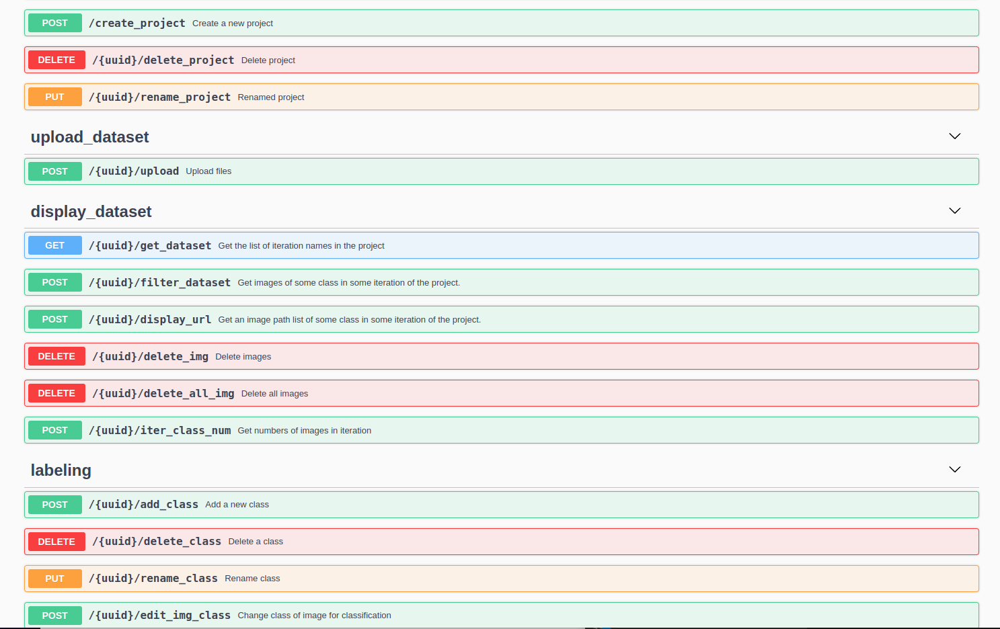
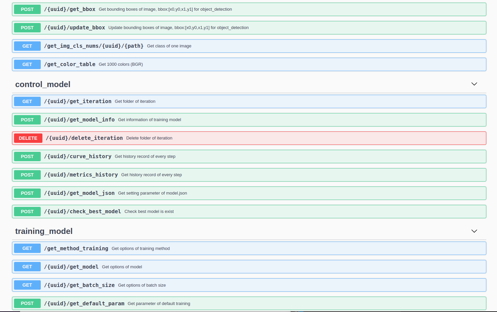
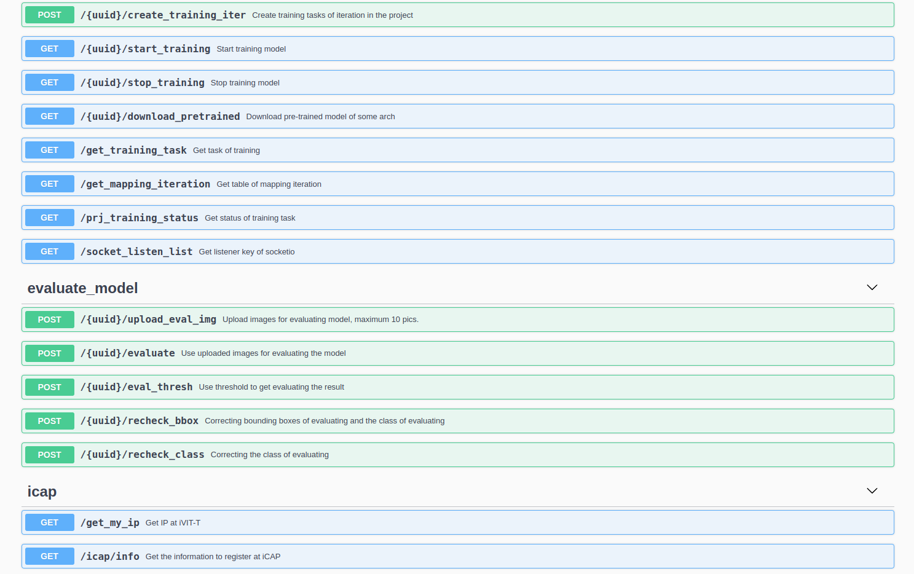

# iVIT-T WEBAPI

This webapi is a packaged application of the training model, you can link your designed user interface with this webapi.

##  Start service
When you open the container, then
```shell
python3 app.py -port XXXX
```

This "-port" is the port number, you can setting haven't used the port number.

## Testing
We recommand Postman to test your web api , you could see more detail in {IP Address}:{PORT}/apidocs.
<details>
<summary>apidocs</summary>
    <div align="center">
        
        
        
        
        
    </div>
</details>